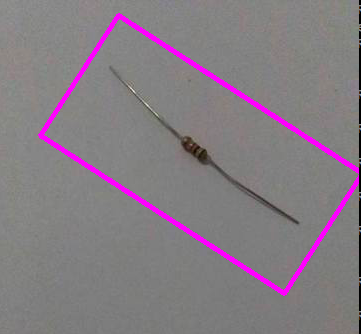
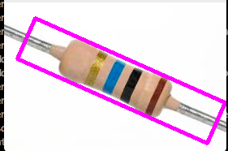
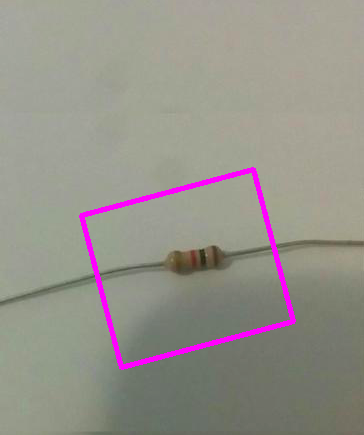

README.md

## Demo

## Reference
See the following paper:
Automated Resistor Classification by
Pascal Niklaus and Gian Ulli, from
Distributed Computing Group, Computer Engineering and Networks Laboratory, ETH Zürich

## Key Assumptions
1. Low Noise Background

The image background should be quite plain (e.g a piece of paper).

2. Single Resistor

For simplicity there should only be one resistor present

3. Straight Wires

The wires connected to a resistor body are 

## Pipeline Description
1. Resistor Localization

Locating the bounding box enclosing the resistor is divided into the following steps.

1.1 Noise Filtering

In this stage the filter attempts to get rid of camera artifacts (e.g salt and pepper noise) in preparation for the next step.

1.2 Hough Line Detection

The resistor body and its wires are not neccesarily perfectly horizontal and is assumed to be in any orientation.
The Hough Line algorithm will detect various straight lines in the image based on arbitruary thresholding.

1.3 Statistical Analysis

The set of lines returned from the Hough transform are analyzed and "similar lines" are grouped together. Quantifying the
similarity of lines is still quite arbitrary.

2.Color Ring Detection

Each color band on the resistor needs to be identified. Current issues with color matching are non-trivial.
To to be completed.
